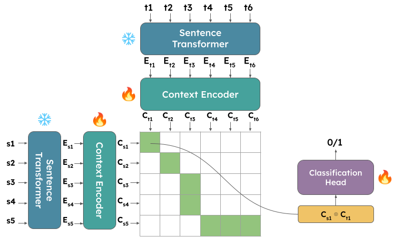

#  CroCoAlign: A Cross-Lingual, Context-Aware and Fully-Neural Sentence Alignment System for Long Texts.

This is the official repository for *CroCoAlign: A Cross-Lingual, Context-Aware and Fully-Neural Sentence Alignment System for Long Texts*.  
For additional information, check out the paper at the following link <link>.

## Features

- Sentence alignment using sentence embeddings and context encoder. 
- Support for various languages.
- Customizable alignment strategies.
- Evaluation metrics for alignment quality.

## Installation

To install CroCoAlign, follow these steps:

1. Clone the repository: `git clone https://github.com/Babelscape/CroCoAlign.git`
2. Create a new conda environment from the env.yml file: `conda env create -f environment.yml`
3. Activate the environment: `conda activate crocoalign`

## Download

You can download the official checkpoint at the following link: <link>

## Training

To train a new instance of CroCoAlign, run the command:

`python src/sentence_aligner/run.py param_1 ... param_n`

Where param_1 ... param_n are the parameters of the network that can be modified at runtime.  
You can consult which parameters can be changed by accessing the **conf** directory and its subdirectories.  
Alternatively, you can also modify the parameter directly in the .yaml files instead of modifying them at runtime during training. 

## Evaluation

To evaluate CroCoAlign on the Opus book dataset, run the following command:

`python src/sentence_aligner/evaluate.py ckpt_path test_data_path`

You can call the script with the `-h` command to get information about the available command options.  
The data is already splitted into train, val and test and its available under the **data** folder. 

To reproduce the paper results against Vecalign, you can run the following script:

`python data/results/scripts/paper_results.py data/results/data/books/crocoalign-{version}.tsv`

Where {version} needs to be replaced with one of the available recovery strategies.  
See the content of the **results/data/books/** folder to see the available options.

## Inference

To align your own parallel documents using CroCoAlign, you can run the following command:

`python scr/sentence_aligner/crocoalign.py source_document target_document`

You can call the script with the `-h` command to get information about the available command options.  
The default format of the source and target document is considered to be .txt.  
In case you would like to try another sentence encoder, you can either provide a .jsonl files containing the source and target sentences with or without precomputed sentence embeddings (by using the `-p` command) or selecting another sentence encoder at runtime.  
You can also select the desired output format of the final alignment (either .tsv or .jsonl). 